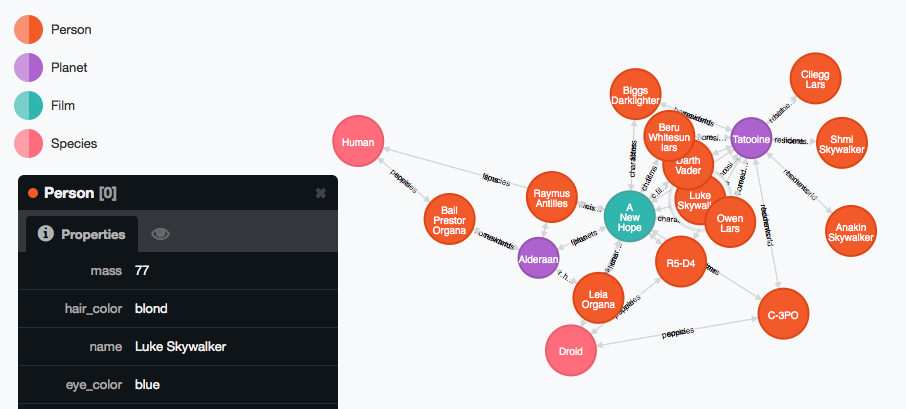

Just a fun project I put together to consume the Star Wars API (http://swapi.co/) and import it into neo4j.



To run, simply execute:

```
./setup.bash
```

When you are done you can shut down the neo4j server by executing:

```
rake neo4j:stop
```

This will install neo4j into the rails app directory, configure it for port 1138, start it up, run the import, and open the web console in your default browser.

I'd like to do something with the Rails app itself, but this is nice for now ;)

Happy graphing!

